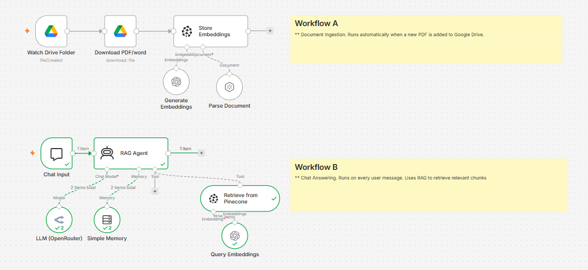

# PDF RAG Chatbot

An AI chatbot that answers questions from your own PDF documents.
Drop a PDF into Google Drive — it gets automatically ingested, 
chunked, embedded, and stored. Ask questions via chat and get 
accurate, document-grounded answers.

## Architecture

## How it works

**Workflow A — Document Ingestion**
- Google Drive Trigger detects a new PDF
- File is downloaded and parsed into text
- Text is split into chunks, converted to embeddings (OpenAI)
- Embeddings stored in Pinecone vector database

**Workflow B — Chat Answering**
- User sends a question via chat
- AI Agent retrieves relevant chunks from Pinecone
- OpenRouter LLM generates a grounded answer
- Window Buffer Memory maintains conversation context

## Tech Stack
| Component | Tool |
|---|---|
| Automation | n8n |
| Vector Database | Pinecone |
| Embeddings | OpenAI text-embedding-3-small |
| LLM | OpenRouter |
| Document Source | Google Drive |

## Setup
1. Import both workflow JSON files into n8n
2. Add credentials: Google Drive, Pinecone, OpenAI, OpenRouter
3. Activate both workflows
4. Drop a PDF into your watched Drive folder
5. Open the chat URL and ask questions

## What I learned
- Full RAG pipeline from ingestion to generation
- Vector embeddings and similarity search
- AI Agents with tool use in n8n
- Conversation memory management
